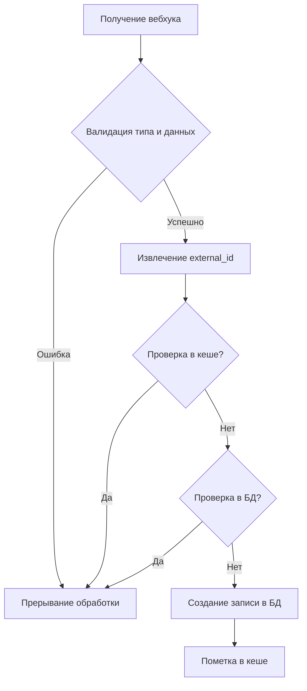

Тестовое задание PLATRUM

## Задание 1 Решение проблемы "MySQL query error"

### Изменения в коде:
Реализована пакетная обработка ID пользователей:
- Большие наборы ID разбиваются на чанки по 10 000 элементов
- Для каждого чанка выполняется отдельный SQL-запрос
- Результаты объединяются в единый массив

---

## Задание 2: Решение проблемы "cURL error 28: Connection timed out"

### Стратегия:
1. **Многоуровневая диагностика** сетевой инфраструктуры
2. **Адаптивные решения** с балансом безопасности и производительности
3. **Проактивный мониторинг** ошибок соединения

### Ключевые решения:
- Увеличение таймаутов с коррекцией под нагрузку
- Реализация retry-механизма с экспоненциальной задержкой
- Безопасная работа с SSL/TLS соединениями
- Комплексное логирование параметров запросов

---

## Задание 3: Решение проблемы дублирования вебхуков

### Проблема:
Сторонний сервис отправляет дубликаты вебхуков с одинаковым ID, что приводит к созданию повторных записей в таблице `deal`.

### Решение:
Реализована двухуровневая система защиты от дублирования:

1. **Кеш-уровень:**
   - Быстрая проверка обработки вебхука через Redis/Memcached
   - Ключ: `webhook_{external_id}`
   - TTL: 1 час (автоматическая очистка старых записей)

2. **БД-уровень:**
   - Гарантированная проверка существования записи по `external_id`
   - Уникальный индекс в таблице `deal` для предотвращения дубликатов
   ```sql
   ALTER TABLE deal ADD UNIQUE INDEX udx_external_id (external_id);
   ```

### Ключевые аспекты реализации:
- Идемпотентность: Гарантия однократной обработки одинаковых вебхуков
- Защита от race condition: Двойная проверка (кеш + БД)
- Оптимизация производительности: 99% дублей отсекаются на уровне кеша
- Надежность: Устойчивость к сбоям и перезапускам приложения
- Безопасность: Валидация входящих данных перед обработкой

Алгоритм обработки:


